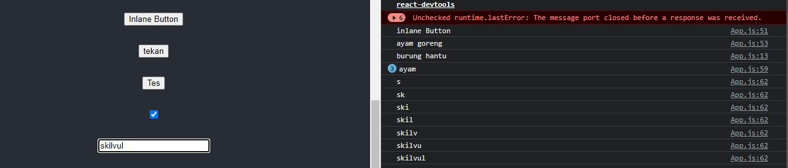
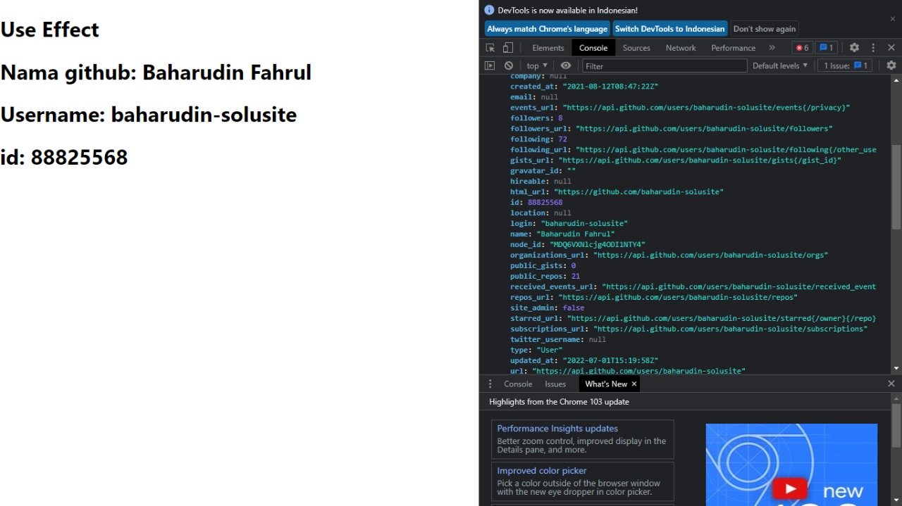
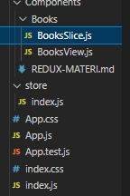

# Writing React JS

1. Introduction React JS
2. React Component
3. React State
4. React useEffect
5. Reach Router

## 1. Introduction React JS
---
### **Apa itu React JS ?**
React JS adalah sebuah library JavaScript yang dibuat untuk membangun user interface

**Bagaiman langkah-langkah ingin menggunakan React JS ?**
1. Pertama diwajibkan menginstal [note.js](https://nodejs.org/en/) terlebih dahulu.
2. Buatlah folder baru untuk meletakan file react Js nantinya.
3. buka CMD Ketik format untuk menginstall react: **npm install -g create-react-app nama-folder**
4. Untuk mengecek kesuksesan proses instalasinya, Anda bisa cek versi reactnya dengan mengetik:
**create-react-app –version** 
5. lalu ketik **cd nama-folder** lalu jalankan react js dengan format **npm start**
---
   


### **Cara kerja React JS**

- index.js
```js
// import file css
import './App.css';
// Penggunaan Export dam Import
import ExportHalaman from './components/ExportHalaman';
// Import local img
import BurungHatu from "./img/burung-hantu.jpg"
function App() {
  // tempat membuat Variabel sebelum return
  let pulang = "ke kampung halaman";
  const perkalian = 9 * 9;
  // event internal
  const handleClick = () => {
    console.log("burung hantu")
  };
  // conditional
  const isLogin = true
  // Map
  const data = [
    {
      orang: "Arrie",
    },
    {
      orang: "Baharudin",
    },
    {
      orang: "Mirza"
    }];

  return (
    // JSX
    // react membutuhkan pembunggkus untuk parentnya
    <div className="App">
      <header className="App-header">
        {/* import halaman */}
        <ExportHalaman />

        {/* url image */}
        

        {/* local image */}
        <br />
        


        {/* Penggunaan class pada React yaitu menggunakan ClassName */}
        <h3 className='nama'>Baharudin</h3>

        {/* Curly Braces in JSX */}
        <h2> {7 + 7} </h2>

        {/* Variabel harus dipanggil Terlebih dahulu */}
        <h4> {pulang} </h4>
        <h3> {perkalian} </h3>
        <p> {"surabaya".toUpperCase()} </p>

        {/* Event */}
        {/* Pembuatan Button secara inlane */}
        <button onClick={() => console.log("inlane Button")}>Inlane Button</button>
        <br />
        <button onClick={() => console.log("ayam goreng")}>tekan</button>

        {/* pembuattan button secara internal */}
        <br />
        <button onClick={handleClick}>Tes</button>

        {/* checkbox */}
        <br />
        <input type={"checkbox"} onChange={() => console.log("ayam")} />

        {/* input form */}
        <br />
        <input type={"text"} onChange={(event) => console.log(event.target.value)} />


        <br />
        {/* conditional */}
        {/* satu - satunya codisional yang bisa dipakai pada React Js Ternary operator */}
        {isLogin ? <p>sudah login</p> : <p>belum login</p>}


        {/* maping menampilkan Array of object */}
        {data.map((item, index) => (
          <h1 key={index}>{item.orang}</h1>
        ))}
      </header>
    </div>
  );
}

export default App;

```
- ExportHalaman.jsx
```js
import React from 'react'

function ExportHalaman() {
    return (
        <div>
            <h2>ExportHalaman</h2>
        </div>
    )
}

export default ExportHalaman
```

- Tampilan pada Browser
  




## 2. React Component
---

### **Apa sih react component itu ?**

Component adalah potongan kode kecil yang dapat di gunakan kembali (reusable) yang bertujuan agar user interface terpisah menjadi bagian-bagian kecil dan di satukan dan di render menjadi sebuah kode HTML.


**Penggunan Component**

*ilustrasi*


### **Membuat sebuah komponen**
Membuat sebuah component pada React kita memerlukan sebuah folder component bertujuan agar file component nantinya tersusun rapi 

Dalam pembuatan folder,file,dan function component harus menggunakan huruf besar diawal


### **Stateful dan Stateless Component**


**Stateless Component**

Web atau aplikasi yang tidak membutuhkan perubahan state/ keadaan seperti pengunaan  table dan button.

**Stateful Component**

web atau aplikasi yang membutuhkan perubahan state/keaadaan seperti benner dan form


### **State & Props**
Ada 2 unsur penting dalam component yaitu UI (User Interface) & Data.

Type data pada component react itu cuma dua yaitu **Prop dan State**.Dari sisi programming component react itu dibuat dengan function atau class

**lalu apa bedanya function dan class pada component?**

- Untuk sekarang ingat saja functional component tidak memiliki state, itu sebabnya biasa disebut stateless component.
- Sedangkan class component bisa memiliki prop dan state.


### **Props Component**

App.js
```jsx
import "./App.css";
import Course from "./component/Course/Course";
const App = () => {
  return (
    // JSX
    <div className="App">
      <header className="App-header">
        // data dipanggil
        <Course />

      </header>
    </div>
  );
};

export default App;
```
CourseCard.jsx
```js
import React from 'react'

// pemberian props pada parameter sebagai jalur sebuah data yang dikirim dari file lain
// props berfungsi untuk mengoper sebuah data 
const CourseCard = (props) => {
    return (
        <div style={{ display: "flex" }}>
            <div>
                <iframe width="400" 
                height="200" src={`https://www.youtube.com/embed/${props.embedId}`} 
                title="YouTube video player" 
                allow="accelerometer; autoplay; clipboard-write; encrypted-media; gyroscope; picture-in-picture" />
            </div>
            <div style={{ textAlign: "left", marginLeft: "20px" }}>
                <h4>{props.title}</h4>
                <p>{props.detail}</p>
            </div>
        </div>
    )
}

export default CourseCard;

```
Course.js
```jsx
import React from 'react'
import CourseCard from './CourseCard'
function Course() {
    return (
        <div>
            <h2>Course</h2>
            <div style={{ display: "flex", padding: '50px' }}>
                {/* Props adalah Properti */}
                {/* props disini sebagai pengirim sebuah data */}
                <CourseCard title="Warriors | Season 2020 Cinematic" 
                detail="League of Legends (ft. 2WEI and Edda Hayes)" 
                embedId="aR-KAldshAE" />

                <CourseCard title="Cara deploy aplikasi NodeJS ke HEROKU dari 0 sampai berhasil" 
                detail="Tutorial  NodeJS ke HEROKU"
                embedId="WY6eVl8FzTg" />
                {/* <CourseCard /> */}

            </div>

        </div>
    )
}

export default Course;
```
### hasil Props


## 3. React State
---
state adalah data yang dimiliki sebuah component dan data tersebut dapat berubah atau dapat di update kembali. 

Data apa saja yang berubah pada sebuah web atau aplikasi?

data yang selalu berubah yaitu benner,input form, card produk, contact dll, yang bersifat data 

### **useState**
useState, adalah fitur dari React untuk membuat sebuah state pada functional component

**cara sederhana useState Hooks**
1. import useState dari react 
   ```js
   import {useState} from "react";
   ```
2. menuliskan userState hooks
   ```js
    const [nama, setNama] = useState("Baharudin");
   ```
3. memanggil data useState
   ```js
   <h3>{nama}<h3>
   ```
**Membuat Menu keranjang nama produk dan Counter**

- App.js
```js
// import useState
import { useState } from 'react';
// import Cartitem
import Cartitem from './component/Cartitem';
function App() {
  // menuliskan useState hooks
  // fungsi penulisan (setNama) untuk mengubah data (nama)
  const [nama, setNama] = useState("Baharudin")
  // membuat data menjadi array agar mudah dibaca
  const [hewan] = useState([
    "Monyet", "Srigala", "Kura-Kura", "Hiu", "kucing"
  ])

  return (
    <div>
      {/* memanggil useState */}
      {/* bila di tekan akan berubah namanya */}
      <h2 onClick={() => setNama("Fahrul")}>{nama}</h2>

      {/* loping data dengan map colback */}
      {hewan.map((item, index) => (
        <Cartitem key={index} hewan={item} />
      ))}

      {/* perbanyak sebuah data manual */}
      <Cartitem hewan="Monyet" />
      <Cartitem hewan="Srigala" />
      <Cartitem hewan="Kura-Kura" />
    </div>
  );
}

export default App;

```
- Couter.js
```js
import React from 'react'
import { useState } from 'react';

function Counter() {
    /* membuat sebuah state */
    const [count, setCount] = useState(0)

    const decrement = () => {
        if (count > 0) {
            setCount(count - 1)
        }
    }

    return (

        <div>
            {/* membuat sebuah state */}
            {/* membuat sebuah couter bagaimana nantinya nilai yang dihasilkan tidak minus */}
            <button onClick={decrement}>-</button>
            <span> {count} </span>
            <button onClick={() => setCount(count + 1)}>+</button>
        </div>
    )
}

export default Counter
```

- Cartitem.js
```js
import React from 'react'
import Counter from './Counter'
function Cartitem(props) {
    return (

        /* membuat item cart */
        <div style={{ display: "flex" }}>
            <span>{props.hewan}</span>
            {/* Jumlah */}
            <Counter />
        </div>
    )
}

export default Cartitem

```
- Tampilan browser
  

## 4. React useEffect (React JS Hooks)

Hooks merupakan fitur baru di React 16.8. baru dikenalkan pada tahun 2018 Fitur ini memungkinkan Anda menggunakan state dan fitur React lainnya tanpa menuliskan sebuah kelas.
 


Hooks yang seriang diggunakan, adalah useState dan useEffect. untuk materi hooks ini akan lebih fokus pada useEffect

**Perbedaan class dan functional**
class menggunakan state sedangkan functional menggunakan state hooks sekilas hasil yang dikeluarkannya sama tidak ada perbedaaan

**kelebihan penggunaan hooks**
- lebih rapi penggunaannya
- lebih pendek 
- mudah dimengerti

**useEffect hooks**

useEffect merupakan hooks yang bisa digunakan untuk menggunakan ***lifecycle*** pada functional component dengan mudah

**Apa itu lifecycle**

LifeCycle yaitu sebuah proses yang dilakukan component yang sedang berjalan 

LifeCycle yang ada didalam hooks hanya mennggunakan useEffect yang menggabugkan 
- Mounting
- Updating
- Unmouting
  


**Cara Penggunaan useEffect di react untuk menampilkan data Github**

1. instal axios dengan format: **npm i axios**
2. import axios dan useEffect
3. siapkan data github
4. berikut ini penggunaan useEffect pada react


- App.js
```js
import { useEffect, useState } from "react";
import axios from "axios";

function App() {
  const [dataGithub, setDataGithub] = useState({});

  // useeffect call api
  let url = "https://api.github.com/users/baharudin-solusite";

  useEffect(() => {
    async function getAPI() {
      const result = await axios.get(url);
      console.log(result);
      setDataGithub(result.data);
    }

    getAPI();
  }, []);

  console.log(dataGithub);

  return (


    <div className="App">
      <h1>Use Effect</h1>
      {/* useEffect data github  */}
      <h1>Nama github: {dataGithub.name}</h1>
      <h1>Username: {dataGithub.login}</h1>
      <h1>id: {dataGithub.id}</h1>
    </div>
  );
}

export default App;

```
- hasil broser
- 



## 5. Reach Router
---

**langgkah2 penggunaan react Router Dom**

1.  buat project Reactjs terlebi dahulu react terlebih dahulu
2.  masuk ke folder project buka terminal lalu tekan format: **npm i react-router-dom**
3.  lalu ubah App.js seperti dibawah ini

App.js
```js
import React from "react";
import {
  BrowserRouter as Router,
  Switch,
  Route,
  Link
} from "react-router-dom";


export default function BasicExample() {
  return (
    <Router>
      <div>
      // navbar link yang nantinya akan digunakan 
        <ul>
          <li>
            <Link to="/">Home</Link>
          </li>
          <li>
            <Link to="/about">About</Link>
          </li>
          <li>
            <Link to="/dashboard">Dashboard</Link>
          </li>
        </ul>

        <hr />

        {/*
         memiliki banyak rute, tetapi Anda hanya menginginkan satu
          dari mereka untuk dirender pada suatu waktu
        */}
        <Switch>
          <Route exact path="/">
            <Home />
          </Route>
          <Route path="/about">
            <About />
          </Route>
          <Route path="/dashboard">
            <Dashboard />
          </Route>
        </Switch>
      </div>
    </Router>
  );
}

// halaman yang akan muncul
// in your app.

function Home() {
  return (
    <div>
      <h2>Home</h2>
    </div>
  );
}

function About() {
  return (
    <div>
      <h2>About</h2>
    </div>
  );
}

function Dashboard() {
  return (
    <div>
      <h2>Dashboard</h2>
    </div>
  );
}
```

- hasil browser


**apa fungsinya react router**

# **Writing minggu ke 2 React JS** 

1. React Redux
2. React Redux Thunk
3. React Context
4. React Bootstrap
5. Reach Testing
  
## React Redux
- Redux adalah salah satu state management 

**Kelebihan React Redux**
- sebagai data Base
- bussiness logic
- Mudah digunakan dan dipelajari
- Memanajemen state

**Langkah membuat redux**
- buat folder react
- instal redux, **npm install react-redux axios @reduxjs/toolkit** 
- membuat folder Store dan component dimana store memiliki file index.js
  
  

berikut ini contoh penggunaan redux


BookSlice.js
```js
import { createSlice } from "@reduxjs/toolkit";

const initialState = {
  totalBooks: 0,
};

const bookSlice = createSlice({
  name: "book",
  initialState,


  reducers: {
   
    kurang: (state) => {
      state.totalBooks--;
    },
    tambah: (state) => {
      state.totalBooks++;
    },


  },
});

export default bookSlice.reducer;
export const { kurang, tambah } = bookSlice.actions;
```
BooksView.js
```js
import { useSelector, useDispatch } from "react-redux";
import { kurang, tambah } from "./BooksSlice";

const BooksView = () => {
  const dispatch = useDispatch();

  // Mengambil dari store
  const totalBooksRedux = useSelector((state) => state.book.totalBooks);

  console.log("total", totalBooksRedux);

  return (
    <div>
      <h1>BooksView</h1>
      <h1>Total Books: {totalBooksRedux}</h1>

      <button onClick={() => dispatch(kurang())}>kurang</button>
      <button onClick={() => dispatch(tambah())}>tambah</button>
    </div>
  );
};

export default BooksView;
```
Store/index.js
```js
import BooksView from "./Components/Books/BooksView"

function App() {
  return (
    <div>

      <BooksView />

    </div>
  );
}
export default App;
```

index.js
```js
import React from "react";
import ReactDOM from "react-dom/client";
import "./index.css";
import App from "./App";
import reportWebVitals from "./reportWebVitals";

// redux
import { Provider } from "react-redux";
import store from "./store";

const root = ReactDOM.createRoot(document.getElementById("root"));
root.render(
  <React.StrictMode>
    <Provider store={store}>
      <App />
    </Provider>
  </React.StrictMode>
);

// If you want to start measuring performance in your app, pass a function
// to log results (for example: reportWebVitals(console.log))
// or send to an analytics endpoint. Learn more: https://bit.ly/CRA-vitals
reportWebVitals();
```

## React Redux Thunk

memungkinkan Anda memanggil pembuat tindakan yang mengembalikan fungsi

**cara penggunaannya**

```js
import axios from "axios";
import { createSlice, createAsyncThunk } from "@reduxjs/toolkit";

const initialState = {
  loading: false,
  users: [],
  error: "",
};

export const fetchUsers = createAsyncThunk("user/fetchUsers", () => {
  return axios
    .get("https://jsonplaceholder.typicode.com/users")
    .then((response) => response.data);
});

const userSlice = createSlice({
  name: "user",
  initialState,
  extraReducers: (item) => {
    // proses request data
    item.addCase(fetchUsers.pending, (state) => {
      state.loading = true;
    });
    // ketika data berhasil didapatkan
    item.addCase(fetchUsers.fulfilled, (state, action) => {
      state.loading = false;
      state.users = action.payload;
      state.error = "";
    });
    item.addCase(fetchUsers.rejected, (state, action) => {
      state.loading = false;
      state.users = [];
      state.error = action.error;
    });
  },
});

export default userSlice.reducer;

```


## React Context

Konteks React memungkinkan kita untuk meneruskan dan menggunakan (mengkonsumsi) data dalam komponen apa pun yang kita butuhkan di aplikasi React.

**kelebihan react context**
- lebih simpel dan mudah penggunaanya dari pada redux
- hanya perlu mengimpor dan export data dari reactnya langsung
- tidak perlu menginstall tool/data apapun

```js
// import yang diperlukan
import { useState, createContext, useEffect } from "react";
import axios from "axios";

// buat dulu setup context dengan createContext
export const UserContext = createContext();

// komponen provider untuk menyediakan si data context
const UserContextProvider = (props) => {
  const [user] = useState({
    // data
    name: "Baharudin",
    batch: "Joyfull Jasper",
  });
  const [userData, setUserData] = useState([]);

  useEffect(() => {
    const getData = async () => {
      const result = await axios.get(
        "https://jsonplaceholder.typicode.com/users"
      );
      setUserData(result.data);
    };

    getData();
    console.log(userData);
  }, []);

  return (
    <UserContext.Provider value={{ user, userData }}>
      {props.children}
    </UserContext.Provider>
  );
};
export default UserContextProvider;

```

## Reach Testing


