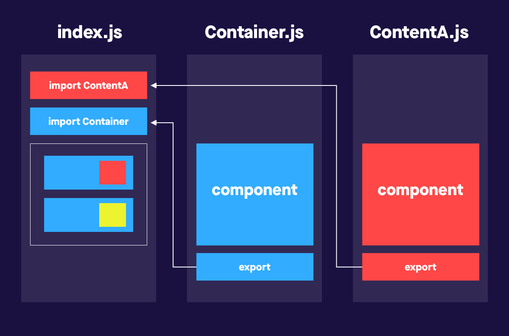
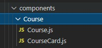

# Writing React JS

1. Introduction React JS
2. React Component
3. React State
4. React useEffect
5. Reach Router

## 1. Introduction React JS
---
### **Apa itu React JS ?**
React JS adalah sebuah library JavaScript yang dibuat untuk membangun user interface

**Bagaiman langkah-langkah ingin menggunakan React JS ?**
1. Pertama diwajibkan menginstal [note.js](https://nodejs.org/en/) terlebih dahulu.
2. Buatlah folder baru untuk meletakan file react Js nantinya.
3. buka CMD Ketik format untuk menginstall react: **npm install -g create-react-app**
4. Untuk mengecek kesuksesan proses instalasinya, Anda bisa cek versi reactnya dengan mengetik:
**create-react-app –version** 
5. lalu ketik **cd nama-folder** lalu jalankan react js dengan format **npm start**

## 2. React Component
---

### **Apa sih react component itu ?**

Component adalah potongan kode kecil yang dapat di gunakan kembali (reusable) yang bertujuan agar user interface terpisah menjadi bagian-bagian kecil dan di satukan dan di render menjadi sebuah kode HTML.

**Penggunan Component**

*ilustrasi*

### **Membuat sebuah komponen**
Membuat sebuah component pada React kita memerlukan sebuah folder component bertujuan agar file component nantinya tersusun rapi 

Dalam pembuatan folder,file,dan function component harus menggunakan huruf besar diawal

## 3. React State
---
## 4. React useEffect
---
## 5. Reach Router
---